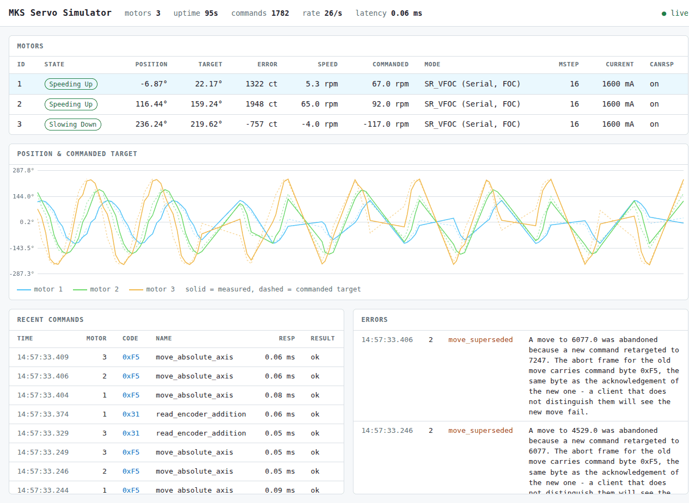

<p align="center">
  
</p>


# MKS Servo CAN Control Project (WIP)
This project provides a Python library (`mks-servo-can`) for controlling MKS SERVO42D and MKS SERVO57D motors via a CAN bus interface, and a command-line simulator (`mks-servo-simulator`) for testing and development without physical hardware. The system is designed with `asyncio` for asynchronous operations, enabling efficient handling of I/O and motor communications.

**Key Reference:** The functionality and command implementations are primarily based on the "MKS SERVO42D/57D_CAN User Manual V1.0.6".

## Key Features

### Python Library (`mks-servo-can`)
* **Asynchronous Operations**: Built with `asyncio` for non-blocking communication and control.
* **Low-Level API**: Direct implementation of CAN commands as specified in the MKS user manual.
* **High-Level API**:
    * `Axis` class for intuitive control of individual motors.
    * `MultiAxisController` for managing and coordinating groups of motors.
* **Kinematics Engine**:
    * Convert between user-defined units (e.g., mm, degrees) and motor encoder/pulse values.
    * Includes `LinearKinematics`, `RotaryKinematics`, and a base for custom kinematics (e.g., `EccentricKinematics`).
    * **Robot Kinematics**: Includes `RobotModelBase` and implementations for common robot types like `TwoLinkArmPlanar`, `CartesianRobot`, and `RRRArm` found in `mks_servo_can.robot_kinematics`. These allow for controlling multi-axis robots in task space (e.g., Cartesian coordinates).
* **Motor Digitizer System**:
    * Record motor positions during manual movement (motors disabled).
    * High-precision playback with timing synchronization and statistical analysis.
    * Precision testing with automated assessment (EXCELLENT/GOOD/FAIR/POOR).
    * Surface mapping and height profiling capabilities for complex geometries.
    * Advanced plotting capabilities including SVG rendering and calligraphy.
* **Real-Time Streaming Control** (`mks_servo_can.realtime`):
    * `ServoStream` drives several axes from a fixed-rate loop, streaming absolute
      position targets fire-and-forget. For tracking a moving reference, where the
      target changes faster than any single move completes.
    * `AlphaBetaTracker` / `AlphaBetaGammaTracker` extrapolate a delayed, noisy
      measurement stream forward by the measured pipeline latency.
    * Soft limits, a producer watchdog, and loop-jitter statistics.
* **Motion Parameter Model** (`mks_servo_can.motor_profile`): converts the MKS
  speed (0-3000) and acceleration (0-255) parameters to and from RPM, deg/s^2 and
  ramp times, including the microstep calibration and work-mode ceilings that
  section 6.1 of the manual describes only in prose.
* **Hardware & Simulator Support**: Can connect to real MKS servo motors via various `python-can` compatible interfaces or to the provided `mks-servo-simulator`.
* **Robust Error Handling**: Custom exceptions for clear diagnostics of communication, motor, and configuration issues.

### CLI Simulator (`mks-servo-simulator`)
* **Hardware-less Development**: Test the `mks-servo-can` library without physical motors.
* **Motor Behavior Modeling**: Simulates multiple MKS servo motors, responding to CAN commands by updating internal states (position, speed, etc.).
* **Virtual CAN Bus**: Emulates CAN bus interactions, managing communication with the library via a TCP socket.
* **One state model, two views**: everything observable comes from
  `SimulatedMotor.status_snapshot()`, so the human and machine surfaces cannot
  report different things about the same motor.
    * **Browser dashboard** (`--debug-api`, then `/dashboard`): motor table,
      rolling position-versus-target plot, named command log, anomaly panel.
      Self-contained — no CDN, works offline.
    * **JSON on stdout** (`--json-output`): one object per line, for a program
      or an agent to consume directly.
    * **Terminal dashboard** (`--textual-dashboard`): motor table and command
      log in a TUI, for when a browser is not available.
* **Anomaly reporting**: surfaces protocol events a client cannot deduce from
  the wire — notably a superseded move, whose abort frame is indistinguishable
  from the acknowledgement of the command that superseded it.
* **Simulated time you can step** (`--step`): the motors move only when
  `POST /step` says so, so a test or an agent can command, step and read with no
  sleeping and get the same answer every run.
* **Configuration Management**: 
    * Save/load configuration profiles for different simulator setups.
    * Motor templates for quick motor configuration (SERVO42D, SERVO57D, high-precision, high-speed).
    * Live parameter adjustment during runtime without restart.
    * Configuration file management with automatic persistence.
* **Advanced Debugging Tools**:
    * **LLM-Friendly Interface**: JSON output mode and HTTP API for Claude Code integration.
    * **Command Injection**: Direct command injection with raw hex commands or pre-defined templates.
    * **Test Scenarios**: Pre-built test sequences for validation and debugging.
    * **HTTP REST API**: Programmatic access to simulator state, command injection, and configuration management.
* **Performance Monitoring**:
    * Real-time latency tracking with percentiles (P95, P99) and histograms.
    * Throughput metrics, error rates, and success statistics.
    * Memory usage monitoring and connection health tracking.
    * Historical performance data and trend analysis.
* **Configurable Parameters**:
    * Number of simulated motors and their CAN IDs.
    * Simulated CAN bus latency to mimic real-world delays.
    * Motor type and basic characteristics (e.g., steps per revolution).
    * Individual motor current limits, speed limits, and position constraints.
* **TCP Socket Interface**: The library connects to the simulator via a TCP socket (default: `localhost:6789`).

### General
* **Determinism Focus**: Designed with considerations for analyzing and understanding timing behavior, aiding in applications with real-time constraints.
* **Comprehensive Test Strategy**: 828 tests — unit, integration against a live
  simulator, wire-format compliance against the manual's transcription,
  determinism under stepped simulated time, and hardware-in-the-loop tests that
  skip without a bench.

## Project Structure

Two Python packages in one distribution (`mks-servo-can`, with the simulator as
its `[simulator]` extra), plus supporting directories:

```text
mks_servo_can/
├── pyproject.toml                   # Packaging and tooling for the whole repo
├── MANIFEST.in                      # Keeps the manual transcription in the sdist
├── mks_servo_can_library/           # The installable Python library (mks_servo_can)
│   ├── mks_servo_can/               # Source code for the library
│   │   ├── data/                    # Package data
│   │   │   └── manual_commands_v106.json  # The manual's command transcription
│   │   ├── kinematics/              # Kinematic transformation modules
│   │   ├── digitizer/               # Motor digitizing and precision testing
│   │   │   ├── base_digitizer.py    # Core MotorDigitizer class
│   │   │   ├── data_structures.py   # DigitizedPoint, DigitizedSequence, etc.
│   │   │   ├── precision_analyzer.py # Statistical analysis and assessment
│   │   │   ├── surface_mapping.py   # Enhanced height mapping capabilities
│   │   │   └── utils.py             # create_linear_axis, create_rotary_axis
│   │   ├── can_interface.py         # Handles real CAN and simulator connection
│   │   ├── low_level_api.py         # Implements MKS CAN commands
│   │   ├── axis.py                  # High-level single motor control
│   │   ├── multi_axis_controller.py # High-level multi-motor control
│   │   ├── realtime.py              # Fixed-rate streaming control + predictors
│   │   ├── motor_profile.py         # Speed/accel parameters <-> engineering units
│   │   ├── robot_kinematics.py      # High-level robot model kinematics
│   │   ├── manual_spec.py           # Loads the packaged manual transcription
│   │   ├── constants.py
│   │   ├── crc.py
│   │   └── exceptions.py
├── mks_servo_simulator/             # The CLI simulator (mks_servo_simulator)
│   ├── mks_simulator/               # Source code for the simulator
│   │   ├── __init__.py
│   │   ├── cli.py                   # Command-line interface (using Click)
│   │   ├── clock.py                 # Real-time and stepped simulated clocks
│   │   ├── motor_model.py           # Simulates individual motor behavior
│   │   ├── virtual_can_bus.py       # Manages simulated CAN traffic
│   │   ├── interface/               # User interface modules
│   │   │   ├── dashboard_page.py    # The self-contained browser dashboard
│   │   │   ├── textual_dashboard.py # Legacy terminal dashboard (--textual-dashboard)
│   │   │   ├── config_manager.py    # Configuration profiles and live adjustment
│   │   │   ├── debug_tools.py       # Command injection and testing framework
│   │   │   ├── performance_monitor.py # Performance tracking and monitoring
│   │   │   ├── llm_debug_interface.py # LLM-friendly debugging interface
│   │   │   ├── sdk_client.py        # Client helper for the debug API
│   │   │   └── http_debug_server.py # HTTP REST API for programmatic access
│   │   └── main.py                  # Entry point for the simulator CLI
├── tests/                           # Test suite (828 tests)
│   ├── unit/                        # Fast; no simulator subprocess needed
│   ├── integration/                 # Against a live simulator
│   ├── simulator_compliance/        # Wire-format conformance vs the manual
│   ├── determinism/                 # Motor model under stepped simulated time
│   ├── hil/                         # Hardware-in-the-loop; see tests/hil/
│   ├── stepped_simulator.py         # In-process simulator on a stepped clock
│   └── fixtures/                    # docs_known_issues.json (documentation ratchet)
├── examples/                        # Example scripts demonstrating library usage
│   ├── camera_gimbal_tracker.py     # 3-axis gimbal tracking a fast target
│   ├── gimbal_cli.py                # One-shot commands to move the printed gimbal
│   ├── single_axis_real_hw.py       # Basic single motor control with real hardware
│   ├── multi_axis_simulator.py      # Multi-motor control with simulator
│   ├── advanced_axis_control.py     # Advanced motor control techniques
│   ├── sync_mks_axis.py             # Example of a synchronous wrapper
│   ├── benchmark_command_latency.py # Performance benchmarking and timing analysis
│   ├── two_link_planar_arm.py       # Example using TwoLinkArmPlanar robot model
│   ├── cartesian_3dof_robot.py      # Example using CartesianRobot model
│   ├── three_link_arm.py            # Example using RRRArm model
│   ├── basic_digitizer_demo.py      # MotorDigitizer library integration demo
│   ├── motor_digitizer.py           # Advanced digitizing with recording/playback
│   ├── digitizer_precision_test.py  # Comprehensive precision testing suite
│   ├── height_map_generator_v2.py   # Surface mapping with digitizer integration
│   ├── enhanced_svg_plotter.py      # SVG plotting with path optimization
│   ├── calligraphy_plotter.py       # Artistic calligraphy and text rendering
│   └── calligraphy_plotter_manual_interpolation.py # Manual interpolation techniques
├── hardware/                        # Printable parts, and how they are checked
│   ├── DESIGNING_PRINTED_PARTS.md   # Manual: toolchain, FDM rules, traps
│   └── gimbal/                      # A pan/tilt mount for two MKS servos
│       ├── gimbal_parts.scad        # The model: four parts and the test modes
│       ├── check_clearances.py      # Interference and screw-driver access
│       ├── check_printability.py    # Overhangs, bridges, bed contact
│       ├── check_slicing.py         # PrusaSlicer's own stability verdict
│       ├── check_physics.py         # Balance about the tilt axis, tipping
│       ├── check_stress.py          # Stress per section, with layer direction
│       ├── stl/                     # Printable exports
│       ├── step/                    # Solids for CAD
│       └── render/                  # Images used by the gimbal README
├── docs/                            # Detailed documentation
│   ├── README.md                    # Index of the documentation
│   ├── images/                      # Screenshots referenced from the docs
│   ├── user_guides/                 # Library and simulator guides
│   ├── development/                 # Roadmap, contributing, testing
│   └── appendices/                  # Glossary and reference material
├── CHANGELOG.md                     # Release history
├── README.md                        # Main project README (this file)
├── requirements.txt                 # Core Python dependencies
└── LICENSE.txt                      # Project license
```

## Getting Started

### Prerequisites

* Python 3.9 or higher. 3.9 is the floor and it is tested — the CI matrix runs
  3.9 through 3.13 and `tests/unit/test_regressions.py` asserts the package
  still imports on the oldest. (The old packaging metadata claimed 3.8; nothing
  ever tested it.)
* It is highly recommended to use a Python virtual environment.

**For real hardware interaction:**
* `python-can` library: `pip install python-can`
* A `python-can` compatible CAN adapter (e.g., CANable, Kvaser, PCAN, SocketCAN compatible device).
* Appropriate drivers and system configuration for your CAN adapter (e.g., `slcand` for serial-line CAN adapters, `gs_usb` kernel module for CANable).
* **Important Hardware Notes:**
    * Ensure correct CAN bus termination (typically 120 Ohms at each end of the bus).
    * Verify proper motor power supply.
    * Double-check CAN H and CAN L wiring.

**For the simulator and everything else:** nothing to install by hand. The
extras below declare it, so `pip install .[simulator]` brings what the simulator
needs and `pip install -e .[dev]` brings the lot. `requirements.txt` is kept only
so that older instructions still do something sensible; `pyproject.toml` is the
source of truth, and a second dependency list is a list that will disagree with
the first.

**Not declared anywhere, because only two example scripts want it:** `numpy`, for
`examples/enhanced_svg_plotter.py` and `examples/height_map_generator_v2.py`.
Install it yourself if you run those.

### Installation

There is **one** distribution, `mks-servo-can`. The simulator is an extra of it,
not a separate package:

```bash
pip install .                # the library alone
pip install .[simulator]     # library + the mks-servo-simulator command
pip install -e .[dev]        # editable, plus the test tooling; for working on it
```

from the repository root. (Not yet on PyPI — see `docs/development/roadmap.md`
item 2 for what is left.)

The extras, and why they are separate:

| extra | pulls in | needed for |
|---|---|---|
| `simulator` | click, rich, fastapi, uvicorn | the `mks-servo-simulator` command, its browser dashboard and its HTTP debug API |
| `dashboard` | textual | only the legacy `--textual-dashboard` TUI |
| `monitoring` | psutil | only the advanced performance-monitoring panels |
| `dev` | all of the above, plus pytest and ruff | running the test suite |

Everything the supported surfaces need is in `simulator`. `dashboard` and
`monitoring` are genuinely optional: without them you lose one flag and a few
panels respectively, and nothing else.

The library and simulator used to be two distributions installed from two
subdirectories, each with its own `setup.py` and its own version number. They
are now one, because the simulator hard-depends on the library — it shares its
constants, CRC and motion model rather than reimplementing them — so a second
distribution bought nothing but a version that could drift away from the first.
No `PYTHONPATH` fiddling is needed any more; a single install puts both packages
in the same environment by construction.

## Usage

### 1. Running the Simulator

```bash
# Two motors on CAN IDs 1 and 2, with 5 ms of simulated bus latency
mks-servo-simulator --num-motors 2 --start-can-id 1 --latency-ms 5
```

The simulator listens for library connections on `localhost:6789` by default.
`mks-servo-simulator --help` lists every option.

#### Watching what it is doing

There are two ways to observe a running simulator, and they render the *same*
payload — `SimulatedMotor.status_snapshot()` — so a person and a program are
never told different things about the same motor.

**For a human — the browser dashboard:**
```bash
mks-servo-simulator --debug-api --num-motors 3
# then open http://127.0.0.1:8765/dashboard
```
Live motor table, a rolling plot of measured position against commanded target,
the recent command log with commands resolved to their manual names, and an
anomaly panel. The page is a single self-contained file with no CDN, no fonts
and no external assets, so it works on a bench with no internet.



Three motors tracking sine references at different rates. Solid lines are
measured position, dashed are the commanded target; the gap between them is the
lag the motion model produces. The anomaly panel on the right is showing
`move_superseded` — see below.

**For a program — JSON on stdout:**
```bash
mks-servo-simulator --json-output --num-motors 2
```
One JSON object per line, nothing else on stdout, so `json.loads` per line
works. Each `status_update` carries every motor's full state.

The same data is available over HTTP while `--debug-api` is running:

| endpoint | purpose |
|---|---|
| `/status` | complete state: every motor, comms statistics, recent commands, anomalies |
| `/motors/{id}` | one motor |
| `/summary` | one-line text summary, for dropping into a prompt |
| `/commands` | the command reference from the manual specification |
| `/validate` | POST an expected state, get a pass/fail report |
| `/health` | liveness and uptime |
| `/docs` | interactive OpenAPI documentation |

#### Anomalies

The simulator reports protocol events a client cannot deduce from the wire. The
one that matters most is a superseded move: re-targeting `0xF5` while a move is
running makes the motor abort the old move, and the abort frame carries *the
same command byte* as the acknowledgement of the command that superseded it. A
client that does not distinguish them sees a move fail for no visible reason.
The simulator knows which frame is which and says so, in `/status`'s `errors`
array and in the dashboard's anomaly panel.

#### Simulated time you can step

```bash
mks-servo-simulator --step --num-motors 2
# then: curl -X POST http://127.0.0.1:8765/step -d '{"seconds": 0.5}'
```

The motors do not move until told to. `POST /step` advances simulated time by
the amount asked for and returns the resulting `/status` once every motor has
finished the last sub-step, so a client can command, step and read with no
sleeping anywhere and get the same answer on every run and every machine.

`--step` implies `--debug-api`, since `/step` is the only way to drive it, and it
governs the *motors*: bus latency and your own code still run in real time, so
pair it with `--latency-ms 0` for an end-to-end measurement.
`docs/user_guides/simulator/advanced_simulation.md` has the details.

#### Configuration profiles

```bash
# Save the current configuration, then start from it later
mks-servo-simulator --save-config my_setup --num-motors 2
mks-servo-simulator --config-profile my_setup

# Keep profiles somewhere other than ~/.mks_simulator_config
mks-servo-simulator --config-dir ./my_configs --config-profile my_setup
```

#### Terminal dashboard

```bash
mks-servo-simulator --textual-dashboard --num-motors 3
```
A Textual TUI showing a motor table and command log. Keys: `q`/`escape` quit,
`r` refresh, `p` pause, up/down select a motor. It runs on the simulator's own
event loop and so competes with the motor integration for scheduling; prefer
the browser dashboard when timing fidelity matters.

### 2. Using the Library

Refer to the scripts in the `examples/` directory for complete, runnable code:

**Basic Motor Control:**
* `examples/single_axis_real_hw.py`: Shows how to connect to and control a physical motor.
* `examples/multi_axis_simulator.py`: Demonstrates controlling multiple motors with the simulator.
* `examples/advanced_axis_control.py`: Advanced motor control techniques and patterns.

**Robot Kinematics:**
* `examples/two_link_planar_arm.py`: TwoLinkArmPlanar robot model example.
* `examples/cartesian_3dof_robot.py`: CartesianRobot model example.
* `examples/three_link_arm.py`: RRRArm robot model example.

**Motor Digitizer System:**
* `examples/basic_digitizer_demo.py`: Introduction to MotorDigitizer capabilities.
* `examples/motor_digitizer.py`: Advanced recording, playback, and precision testing.
* `examples/digitizer_precision_test.py`: Comprehensive system precision analysis.

**Surface Mapping & Plotting:**
* `examples/height_map_generator_v2.py`: Enhanced surface mapping with digitizer integration.
* `examples/enhanced_svg_plotter.py`: Advanced SVG plotting with path optimization.
* `examples/calligraphy_plotter.py`: Artistic text rendering and calligraphy.

https://github.com/user-attachments/assets/b7e87119-080f-4230-921d-b1fbb9b76aef

**Real-Time Tracking:**
* `examples/camera_gimbal_tracker.py`: A camera gimbal tracking a fast target.
* `examples/gimbal_cli.py`: Move the printed `hardware/gimbal/` from a shell —
  zero it, point it, sweep its limits, read its following error, and write the
  motors' configuration. Every move is verified against the encoder.
  Runs against the simulator with no hardware. Documents the design reasoning -
  why direct drive beats a reduction here, why latency rather than motor speed is
  the binding constraint, and how to size the axes. Three axes by default;
  `--two-axis` drives a pan/tilt build, which is what `hardware/gimbal/` prints.

**Performance & Analysis:**
* `examples/benchmark_command_latency.py`: Command latency measurement and analysis.

**Conceptual Snippet (connecting to the simulator):**
```python
import asyncio
from mks_servo_can import (
    CANInterface, Axis, RotaryKinematics, const, exceptions
)

async def control_simulated_motor():
    # Connect to the simulator
    can_if = CANInterface(use_simulator=True, simulator_host='localhost', simulator_port=6789)
    await can_if.connect()

    # Setup an axis (assuming motor with CAN ID 1 is simulated)
    # Using default encoder pulses for MKS servos (16384 pulses/rev)
    kin = RotaryKinematics(steps_per_revolution=const.ENCODER_PULSES_PER_REVOLUTION)
    motor1 = Axis(can_if, motor_can_id=1, name="SimMotor1", kinematics=kin)

    try:
        await motor1.initialize() # Basic communication check
        await motor1.enable_motor()

        initial_pos_deg = await motor1.get_current_position_user()
        print(f"Motor '{motor1.name}' initial position: {initial_pos_deg:.2f} degrees")

        # Move 90 degrees at 180 deg/s speed
        await motor1.move_to_position_abs_user(initial_pos_deg + 90.0, speed_user=180.0, wait=True)

        final_pos_deg = await motor1.get_current_position_user()
        print(f"Motor '{motor1.name}' final position: {final_pos_deg:.2f} degrees")

        await motor1.disable_motor()

    except exceptions.MKSServoError as e:
        print(f"Error: {e}")
    finally:
        await can_if.disconnect()

if __name__ == "__main__":
    asyncio.run(control_simulated_motor())
```

### 3. Using the Motor Digitizer System

The MotorDigitizer enables recording manual movements and playing them back with precision testing:

```python
import asyncio
from mks_servo_can import CANInterface, MotorDigitizer, create_linear_axis

async def digitizer_example():
    can_if = CANInterface(use_simulator=True)
    await can_if.connect()
    
    # Create digitizer and add axes
    digitizer = MotorDigitizer(can_if)
    x_axis = create_linear_axis(can_if, 1, "X", 40.0)  # 40mm/rev lead screw
    y_axis = create_linear_axis(can_if, 2, "Y", 40.0)
    
    await digitizer.add_axis(x_axis)
    await digitizer.add_axis(y_axis)
    await digitizer.initialize_axes()
    
    # Record manual movements (motors will be disabled for manual control)
    await digitizer.start_recording(sample_rate=10.0)
    
    # Play back with precision testing
    stats = await digitizer.playback_sequence(
        digitizer.current_sequence, 
        precision_test=True
    )
    
    # Analyze precision
    from mks_servo_can import PrecisionAnalyzer
    assessment = PrecisionAnalyzer.assess_precision(stats)
    print(f"System precision: {assessment}")
    
    await digitizer.cleanup()
    await can_if.disconnect()
```

### 4. Using the HTTP Debug API

The simulator provides a comprehensive REST API for programmatic access and LLM integration:

**Configuration Management:**
```bash
# List available configuration profiles
curl http://localhost:8765/config/profiles

# Load a configuration profile
curl -X POST http://localhost:8765/config/profiles/my_setup/load

# Get current configuration
curl http://localhost:8765/config

# Get available motor templates
curl http://localhost:8765/config/templates

# Apply motor template
curl -X POST http://localhost:8765/config/templates/servo42d/apply \
  -H "Content-Type: application/json" \
  -d '{"motor_id": 1}'
```

**Live Parameter Adjustment:**
```bash
# Get adjustable parameters
curl http://localhost:8765/config/parameters

# Update CAN bus latency
curl -X POST http://localhost:8765/config/parameters/latency_ms \
  -H "Content-Type: application/json" \
  -d '{"value": 3.5}'

# Update motor current limit
curl -X POST http://localhost:8765/config/parameters/motors.0.max_current \
  -H "Content-Type: application/json" \
  -d '{"value": 1200}'
```

**Command Injection:**
```bash
# Inject raw command
curl -X POST http://localhost:8765/inject \
  -H "Content-Type: application/json" \
  -d '{"motor_id": 1, "command_code": 246, "data_bytes": [1, 0, 100, 0]}'

# Use template command
curl -X POST http://localhost:8765/inject_template \
  -H "Content-Type: application/json" \
  -d '{"motor_id": 1, "template_name": "enable"}'
```

**Performance Monitoring:**
```bash
# Get current performance metrics
curl http://localhost:8765/performance

# Get performance history
curl http://localhost:8765/performance/history

# Get connection statistics
curl http://localhost:8765/performance/connections
```

### 5. Real-Time Tracking

For anything that follows a moving reference, the discrete-move API is the wrong
model: it waits for each move to finish. `ServoStream` streams targets instead.

```python
import asyncio
from mks_servo_can import CANInterface, ServoStream, StreamAxis, AlphaBetaGammaTracker

async def track():
    can_if = CANInterface(use_simulator=True)
    await can_if.connect()

    axes = [
        StreamAxis("pan", can_id=1, min_position=-170, max_position=170),
        StreamAxis("tilt", can_id=2, min_position=-45, max_position=90),
    ]
    predictor = AlphaBetaGammaTracker(alpha=0.5, beta=0.3, gamma=0.05)

    # Disables motor responses on entry, restores them on exit.
    async with ServoStream(can_if, axes, rate_hz=200) as stream:
        while tracking:
            bearing, captured_at = await detector.next_sighting()
            predictor.update(bearing, captured_at)
            # Extrapolate to when the command will actually take effect.
            horizon = time.monotonic() - captured_at + command_latency
            stream.set_target(
                "pan",
                predictor.predict(horizon),
                feedforward_rate=abs(predictor.predict_velocity(horizon)),
            )
            await asyncio.sleep(0.01)

    await can_if.disconnect()
```

Two things worth internalising before building on this:

* **Prediction dominates.** Pointing error from transport delay is
  `rate x latency`. At 172 deg/s a 50 ms pipeline is 8.6 degrees behind; with
  extrapolation the residual is around 0.3 degrees. Optimising the CAN path is
  worth far less than adding the predictor.
* **Measure the latency, do not guess it.** And count the detector's share
  exactly once - it is already inside the measurement's age. Double-counting it
  is silent and makes the result worse than not predicting at all.

See `examples/camera_gimbal_tracker.py` for a complete, runnable treatment.

## Documentation

Detailed documentation lives in the `docs/` directory; `docs/README.md` is the
index. Alongside it:

* **Docstrings** within the source code, which carry the design rationale.
* The **example scripts** in `examples/`.
* The **"MKS SERVO42D/57D_CAN User Manual V1.0.6"**, obtained separately, for
  specifics on CAN commands and motor behaviour. Its machine-readable
  transcription ships with the library as
  `mks_servo_can/data/manual_commands_v106.json`, reachable at runtime through
  `mks_servo_can.load_manual_spec()`. It covers all 46 commands the library
  implements — `0xC8` and `0xCA` are recorded as deliberately absent, being
  values of `0xFF`'s argument rather than commands — and it is what the
  compliance suite checks the wire format against, so it is a specification
  rather than documentation.
  It also records an **errata** block, because the manual contradicts itself in
  five places: the sign convention (the worked examples, CCW positive, are the
  ones to trust), and three commands whose printed DLC disagrees with the byte
  map beside it, plus a worked example whose printed CRC does not follow from
  its own frame.

## Development and Testing

### Dependencies for Development

One command, from the project root:
```bash
pip install -e .[dev]
```
`[dev]` includes `[simulator]`, `[dashboard]` and `[monitoring]`, so the whole
suite is runnable from that one install.

### Running Tests

Unit, integration, wire-format compliance, determinism and hardware-in-the-loop
tests all live under `tests/`, and `pytest` runs them.

```bash
pytest                          # everything except HIL, which is skipped without hardware
pytest tests/unit               # fast; no simulator subprocess
pytest tests/integration        # fixtures start and stop the simulator for you
pytest tests/simulator_compliance   # every command's framing against the manual
pytest tests/determinism        # the motor model under stepped simulated time, in under a second
```

Nothing needs a simulator started by hand: the fixtures in `tests/conftest.py`
launch one per module on ports 6789/6790/6791 and stop it afterwards. A stray
simulator left running on one of those ports will answer in its place and
quietly change the results, so check for one if a run behaves oddly.

HIL tests require physical hardware and are run manually; see `tests/hil/`.

### Documentation checks

`tests/test_docs_api.py` parses every Python block in `docs/` and this README and
checks that the methods, constructor arguments and imports they reference
actually exist, and that internal links resolve. It runs as part of `pytest`.

It is a **ratchet**: pre-existing problems are listed in
`tests/fixtures/docs_known_issues.json`, and the test fails if a *new* one
appears — so the documentation cannot drift further from the code. It also fails
if a baseline entry no longer occurs, telling you to delete it, so the list can
only shrink.

If you fix a documentation problem, run the test and remove the entries it
reports as stale. If you hit a failure for something you just wrote, fix the
documentation rather than adding it to the baseline.

See `docs/development/roadmap.md` for what is known to be stale and the order the
remaining work is planned in.

## Contributing

Contributions are welcome! Please follow these general guidelines:
1.  **Fork the repository.**
2.  **Create a new branch** for your feature or bug fix (e.g., `feature/my-new-feature` or `fix/issue-123`).
3.  **Write clean, well-commented code** adhering to PEP 8 guidelines. `ruff check .` is what CI runs, and it comes with `[dev]`.
4.  **Include comprehensive docstrings** for all public modules, classes, and functions.
5.  **Add unit tests** for new functionality and bug fixes. Ensure good test coverage.
6.  **Ensure all tests pass** locally before submitting.
7.  **Submit a pull request** to the `main` (or `develop`) branch with a clear description of your changes and any relevant issue numbers.


## License

This project is licensed under the MIT License. See the `LICENSE.txt` file for details.

## AI Disclaimer

* This code may have been generated by an "AI". Side effects may include spontaneous bugs, existential dread, and coffee dependency.
* In case of failures, just blame the AI. But if it starts fixing its own bugs... run.


## Where to buy (affiliated links)
If you're planning to buy one or more motors and controllers to build something awesome with the MKS SERVO CAN library, you can support my work by using the affiliate links below:
* [USB 2 CAN Adapter (the same I have, works nicelly on linux)](https://amzn.to/3Ga00eQ)
* [MKS SERVO42D Closed Loop Stepper Motor Drive CAN](https://amzn.to/3TA9T8M)
* [NEMA 17 Stepper Motor (42x42x39mm)](https://amzn.to/4ndOwYy)
* [NEMA 17 Stepper Motor (42x42x60mm)](https://amzn.to/4ljbZpv)
* [NEMA 17 Stepper Motor (42x42x23mm - pancake style)](https://amzn.to/4edb4EJ)
