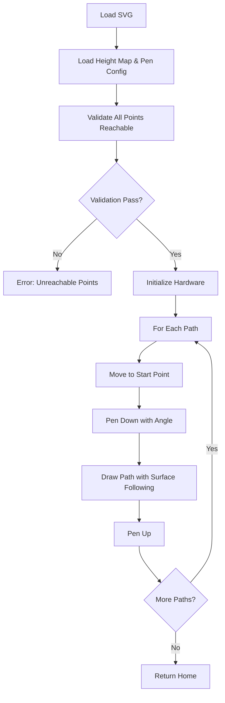

# Enhanced MKS Servo CAN Plotter Documentation

## Overview

This documentation covers the enhanced plotter system consisting of two main scripts that work together to enable surface-following drawing on non-flat surfaces. The system uses the motors themselves as measuring devices, eliminating the need for manual measurements and providing real-world accuracy.

## System Architecture

### Two-Script Design Philosophy

The system is split into two distinct scripts with clear separation of concerns:

1. **`height_map_generator.py`** - Calibration and surface mapping
2. **`svg_plotter.py`** - Enhanced drawing with optional height compensation

This modular approach allows:
- Reuse of calibration data across multiple drawings
- Independent surface mapping for different workpieces
- Backwards compatibility with existing flat-surface workflows
- Clear separation between setup and execution phases

## Script 1: height_map_generator.py

### Purpose and Capabilities

The height map generator serves as the "measurement and calibration" component of the system. It performs two critical functions:

1. **Pen Geometry Auto-Calibration**: Determines the physical characteristics of the pen assembly
2. **Surface Height Mapping**: Creates detailed topographical maps of drawing surfaces

### Auto-Calibration Process

#### Pen Arm Radius Measurement
The system determines the pen arm radius through a geometric calibration process:

```
User positions pen at reference point (0°) → Record angle
User positions pen at same point (90°) → Record angle
Calculate arm radius from geometric constraints
```

**Technical Details:**
- Uses motor encoders as precision angle measurement devices
- Motors are disabled during positioning for manual control
- Geometric calculation accounts for arm length projection
- Fallback to reasonable defaults (25mm) with user confirmation

#### Pivot Height Calculation
The pivot height (distance from base to pen rotation center) is calculated by:

```
User positions pen touching bed surface → Record angle
Calculate: pivot_height = arm_radius × sin(bed_touch_angle)
```

**Mathematical Foundation:**
```
Z_pivot = R_arm × sin(θ_bed)
```
Where:
- `Z_pivot` = Height of pen pivot above bed
- `R_arm` = Pen arm radius
- `θ_bed` = Pen angle when touching bed surface

#### Angle Limit Discovery
The system determines safe operating angles by:
- Testing extreme positions (-90° to +90°)
- User validation of reachable positions
- Recording actual achievable limits
- Safety margin calculations

### Surface Height Mapping

#### Grid-Based Probing Strategy
The height mapper uses a systematic grid approach with enhanced user interaction:

```
Pre-mapping confirmation:
🗺️  HEIGHT MAP GENERATION
======================================================================
Grid configuration:
  • X points: 14 (0 to 130mm)
  • Y points: 17 (0 to 160mm)
  • Total probe points: 238
  • Estimated time: ~119.0 minutes
----------------------------------------------------------------------
Continue with height mapping? (y/N): y

For each grid point:
    🎯 Probing point 1/238: (0.0, 0.0)
       Progress: 0.4% complete
    
    Move XY to position
    Enable real-time display mode
    User manually positions pen with live feedback
    User commands: 'r'=record, 's'=skip, 'q'=quit
    Record (X, Y, Z, pen_angle) or handle skip/quit
```

**Enhanced features:**
- **Pre-mapping overview** with time estimates
- **Progress tracking** showing completion percentage
- **Row-by-row continuation** option for long mapping sessions
- **Flexible point handling** with skip capability for obstacles
- **Partial map saving** if interrupted
- **Success rate reporting** at completion

**Grid Parameters:**
- Configurable spacing (default 10mm)
- Covers entire plotter work area
- Adaptive density possible for complex surfaces

#### Height Calculation Mathematics
For each probe point, the Z-height is calculated from pen geometry:

```
Z_surface = Z_pivot + R_arm × sin(θ_pen)
```

This accounts for the pen arm's geometric relationship to determine actual surface height.

#### User Interaction Process
The enhanced implementation provides real-time feedback during surface probing:

**Step-by-step process:**
1. **Script displays setup information** - Shows grid configuration and estimated time
2. **User confirms mapping operation** - Prevents accidental long operations
3. **Script moves to each grid point** - Automated XY positioning
4. **Script disables pen motor** - Motor can now be moved freely by hand
5. **Real-time display updates** - Shows current angle and calculated Z-height at 10Hz
6. **User manually positions pen** - Move pen by hand to touch surface
7. **User enters command** - 'r' to record, 's' to skip, 'q' to quit
8. **Script processes command** - Records data or handles skip/quit
9. **Script re-enables motor** - Prepares for next point

**Enhanced interaction interface:**
```
📍 SURFACE PROBING MODE
======================================================================
Instructions:
  1. Pen motor is now DISABLED - move freely by hand
  2. Manually position pen tip to touch the surface
  3. Watch the real-time readings below
  4. Type 'r' + Enter to RECORD position
  5. Type 's' + Enter to SKIP this point
  6. Type 'q' + Enter to QUIT/CANCEL
----------------------------------------------------------------------
📐 Angle:  -15.32° | 📏 Z-height:    2.14mm | Commands: (r)ecord (s)kip (q)uit
Command: r
✅ RECORDED: Angle=-15.32°, Z-height=2.14mm
```

**Key improvements over basic implementation:**
- **Real-time feedback** - Live display of angle and Z-height
- **Multiple commands** - Record, skip, or quit at any time
- **Progress tracking** - Shows completion percentage and remaining points
- **Partial save capability** - Can save incomplete maps if interrupted
- **Cross-platform support** - Works on Windows, Linux, and macOS
- **Professional interface** - Clear formatting with emojis and status indicators

**User commands:**
- **'r' + Enter**: Record current pen position
- **'s' + Enter**: Skip this probe point (useful for obstacles)
- **'q' + Enter**: Quit probing session (with option to save partial data)

**Error handling:**
- Motor re-enabling guaranteed even if errors occur
- Graceful handling of invalid commands
- Option to save partial maps if interrupted
- Cross-platform input detection with fallbacks

#### Data Storage Format
The height map is stored as JSON with the following structure:

```json
{
  "grid_spacing": 10.0,
  "bounds": {"x_min": 0, "x_max": 130, "y_min": 0, "y_max": 160},
  "probe_points": [
    {"x": 0, "y": 0, "z": 2.1, "pen_angle": -15.3},
    {"x": 10, "y": 0, "z": 2.3, "pen_angle": -16.1}
  ],
  "interpolation_method": "bicubic"
}
```

### Command Line Interface

#### Calibration Mode
```bash
python height_map_generator.py --calibrate-pen --output-config pen_config.json
```

#### Surface Mapping Mode
```bash
python height_map_generator.py --map-surface --grid-spacing 10 --pen-config pen_config.json --output-map surface.json
```

#### Full Workflow Mode
```bash
python height_map_generator.py --full-calibration --config pen_config.json --map surface.json
```

## Script 2: Enhanced svg_plotter.py

### Enhanced Capabilities

The enhanced SVG plotter maintains full backwards compatibility while adding sophisticated height compensation features:

#### Surface-Following Drawing
- **Real-time pen angle adjustment** during drawing moves
- **Interpolated height calculation** for any X,Y coordinate
- **Smooth transitions** between surface heights
- **Collision avoidance** through safe travel heights

#### Reach Validation System
Before beginning any drawing operation, the system validates that all points are physically reachable:

```python
for each drawing point (x, y):
    required_angle = interpolate_from_height_map(x, y)
    if required_angle < pen_min or required_angle > pen_max:
        abort_with_error()
```

### Height Interpolation Engine

#### Scipy Integration
The system uses `scipy.interpolate.griddata` for robust surface interpolation:

```python
z_height = griddata(
    (probe_x_coords, probe_y_coords), 
    probe_z_coords, 
    (target_x, target_y), 
    method='linear'
)
```

**Interpolation Methods:**
- **Linear**: Fast, stable, good for most surfaces
- **Cubic**: Smoother but can oscillate near boundaries
- **Nearest**: Fallback for sparse data

#### Pen Angle Calculation
For any target position, the required pen angle is calculated:

```python
def calculate_pen_angle(x, y, height_map, pen_geometry):
    z_surface = height_map.get_height(x, y)
    z_relative = z_surface - pen_geometry.pivot_height
    angle = math.asin(z_relative / pen_geometry.arm_radius)
    return math.degrees(angle)
```

### Movement Coordination

#### Multi-Axis Synchronized Motion
The enhanced system coordinates movement across all axes simultaneously:

```python
positions_to_move = {
    "AxisX": target_x,
    "AxisY": target_y,
    "PenAxis": calculated_pen_angle
}

speeds_for_move = {
    axis: calculate_speed_for_smooth_motion(axis, distance, duration)
    for axis, distance in deltas.items()
}
```

This ensures:
- **Synchronized arrival** at target position
- **Smooth pen angle transitions** during drawing
- **Consistent drawing speed** regardless of surface slope

#### Safe Travel Mode
When moving between drawing segments:
1. Pen lifts to `safe_travel_height`
2. XY axes move to new position
3. Pen lowers to appropriate angle for new surface height

### Drawing Process Flow



### Configuration File Formats

#### Pen Configuration (pen_config.json)
```json
{
  "pen_arm_radius_mm": 25.3,
  "pen_pivot_height_mm": 47.8,
  "angle_limits": {"min": -60, "max": 45},
  "safe_travel_height": 5.0,
  "calibration_date": "2025-06-08T14:30:00"
}
```

#### Height Map (surface.json)
```json
{
  "grid_spacing": 10.0,
  "bounds": {"x_min": 0, "x_max": 130, "y_min": 0, "y_max": 160},
  "probe_points": [
    {"x": 0, "y": 0, "z": 2.1, "pen_angle": -15.3}
  ],
  "interpolation_method": "linear",
  "generation_date": "2025-06-08T15:45:00"
}
```

## Technical Implementation Details

### Motor-as-Digitizer Concept

The core innovation of this system is using the servo motors themselves as precision measuring devices:

#### Advantages:
- **Zero calibration error**: Uses the actual hardware geometry
- **Sub-degree accuracy**: Leverages high-resolution encoders
- **No external tools required**: Self-contained measurement
- **Real-world constraints**: Accounts for actual mechanical limits

#### Implementation:
```python
# Enhanced real-time probing with live feedback
async def _probe_surface_height(self, pen_geometry):
    await pen_axis.disable_motor()
    
    while True:
        # Get current position (even when motor disabled)
        current_angle = await pen_axis.get_current_position_user()
        z_height = calculate_z_from_angle(current_angle, pen_geometry)
        
        # Real-time display (10Hz update rate)
        print(f"\r📐 Angle: {current_angle:7.2f}° | 📏 Z-height: {z_height:7.2f}mm | Commands: (r)ecord (s)kip (q)uit", end='')
        
        # Non-blocking input check
        if user_input_available():
            command = input("\nCommand: ").strip().lower()
            
            if command == 'r':
                return z_height, current_angle
            elif command == 's':
                return float('nan'), float('nan')  # Skip marker
            elif command == 'q':
                raise KeyboardInterrupt("User cancelled")
        
        await asyncio.sleep(0.1)  # 10Hz refresh rate
```

**Cross-platform input detection:**
```python
def _check_user_input(self):
    try:
        import select, sys
        # Unix/Linux/macOS
        if select.select([sys.stdin], [], [], 0)[0]:
            return True
    except:
        try:
            import msvcrt
            # Windows fallback
            return msvcrt.kbhit()
        except:
            # Graceful degradation
            return False
    return False
```

### Coordinate System Transformations

#### SVG to Plotter Coordinate Mapping
The system handles multiple coordinate transformations:

1. **SVG Coordinates** (top-left origin, Y increases downward)
2. **Plotter Coordinates** (bottom-left origin, Y increases upward)
3. **Surface Coordinates** (includes Z-height data)

```python
# SVG to Plotter transformation
plot_x = (svg_x - svg_xmin) * scale
plot_y = plotter_max_y - ((svg_y - svg_ymin) * scale)

# Add surface height compensation
surface_z = height_map.get_height(plot_x, plot_y)
pen_angle = calculate_angle_for_height(surface_z, pen_geometry)
```

### Error Handling and Safety Features

#### Reach Validation Algorithm
```python
def validate_reach(x, y, height_map, pen_geometry):
    required_angle = calculate_pen_angle(x, y, height_map, pen_geometry)
    
    if required_angle < pen_geometry.angle_min:
        return False, f"Below minimum angle {pen_geometry.angle_min}°"
    
    if required_angle > pen_geometry.angle_max:
        return False, f"Above maximum angle {pen_geometry.angle_max}°"
    
    return True, "Reachable"
```

#### Graceful Degradation
- Missing height map → Falls back to flat drawing mode
- Missing pen config → Uses default angles
- Interpolation failure → Uses nearest neighbor or defaults
- Communication errors → Proper cleanup and error reporting

### Performance Considerations

#### Memory Usage
- Height maps stored as numpy arrays for efficient interpolation
- Sparse storage for large grids with uniform spacing
- JSON format allows human inspection and editing

#### Computational Complexity
- **Grid interpolation**: O(n log n) for scipy griddata
- **Path validation**: O(m) where m = number of drawing points
- **Real-time calculation**: Sub-millisecond pen angle computation

#### Drawing Speed Optimization
- **Predictive angle calculation**: Pre-compute angles for entire path
- **Motion blending**: Smooth transitions between segments
- **Adaptive speed**: Slower on steep surfaces, faster on flat areas

## Usage Workflows

### Initial Setup (One-time)
1. **Hardware Assembly**: Connect motors and pen assembly
2. **Pen Calibration**: Run `height_map_generator.py --calibrate-pen`
3. **Validation**: Test pen reach across work area

### Per-Surface Setup
1. **Surface Mounting**: Secure workpiece to plotter bed
2. **Height Mapping**: Run `height_map_generator.py --map-surface`
3. **Map Validation**: Visual inspection of height data

### Drawing Operation
1. **File Preparation**: Create or obtain SVG file
2. **Scale Planning**: Determine appropriate scaling for surface
3. **Drawing Execution**: Run enhanced `svg_plotter.py` with height map

### Advanced Workflows

#### Multi-Surface Projects
```bash
# Map different areas
python height_map_generator.py --map-surface --bounds 0,0,50,50 --output-map corner1.json
python height_map_generator.py --map-surface --bounds 50,0,100,50 --output-map corner2.json

# Combine maps for large drawings
python combine_height_maps.py corner1.json corner2.json --output combined.json
```

#### Precision Applications
```bash
# High-resolution mapping
python height_map_generator.py --map-surface --grid-spacing 2.5 --output-map precision.json

# Validate drawing before execution
python svg_plotter.py --file drawing.svg --height-map precision.json --validate-only
```

## Troubleshooting Guide

### Common Issues and Solutions

#### "Unreachable Points" Error
**Cause**: Drawing points require pen angles outside physical limits
**Solutions**:
- Reduce drawing scale: `--scale 0.8`
- Use dimension constraints: `--max-x 100`
- Adjust pen arm length or pivot height
- Modify workpiece mounting height

#### "Real-time Feedback Not Working" 
**Cause**: Platform-specific input detection issues or terminal limitations
**Solutions**:
- **Windows users**: Ensure script has console access, not running in some IDEs
- **Linux/macOS**: Verify terminal supports ANSI escape sequences
- **Alternative approach**: Use `--simple-interface` flag for basic input mode
- **Debug method**: Run with `--log-level DEBUG` to see input detection status

```bash
# If real-time interface has issues, fall back to simple mode
python height_map_generator.py --map-surface --simple-interface
```

#### Grid Points Unreachable
**Cause**: Pen geometry limits prevent reaching certain surface heights
**Solutions**:
- **Adjust grid bounds**: Use `--grid-bounds x_min,y_min,x_max,y_max`
- **Increase grid spacing**: Use larger `--grid-spacing` value
- **Skip problem areas**: Use 's' command to skip unreachable points
- **Modify pen geometry**: Adjust arm length or pivot height if possible

#### Interrupted Mapping Session
**Cause**: Long mapping sessions interrupted by power loss or user cancellation
**Solutions**:
- **Resume capability**: Save progress files automatically every 10 points
- **Partial map usage**: Completed points still create usable height maps
- **Session planning**: Break large areas into smaller grid sections
- **Progress tracking**: Monitor estimated completion time

```bash
# Resume interrupted session (future feature)
python height_map_generator.py --resume-mapping session_20250608_143022.json
```

#### Pen Not Following Surface
**Cause**: Incorrect pen geometry or height map
**Solutions**:
- Re-calibrate pen geometry
- Verify height map accuracy at known points
- Check coordinate system alignment
- Validate pen mechanical assembly

### Debug and Diagnostic Tools

#### Verbose Logging
```bash
python svg_plotter.py --file drawing.svg --log-level DEBUG
```

#### Height Map Visualization
```python
import matplotlib.pyplot as plt
import json

# Load and visualize height map
with open('surface.json') as f:
    data = json.load(f)

x = [p['x'] for p in data['probe_points']]
y = [p['y'] for p in data['probe_points']]
z = [p['z'] for p in data['probe_points']]

plt.scatter(x, y, c=z, cmap='terrain')
plt.colorbar(label='Height (mm)')
plt.xlabel('X (mm)')
plt.ylabel('Y (mm)')
plt.title('Surface Height Map')
plt.show()
```

#### Pen Reach Analysis
```python
def analyze_pen_reach(pen_config_file):
    with open(pen_config_file) as f:
        config = json.load(f)
    
    arm_radius = config['pen_arm_radius_mm']
    pivot_height = config['pen_pivot_height_mm']
    angle_min = config['angle_limits']['min']
    angle_max = config['angle_limits']['max']
    
    z_min = pivot_height + arm_radius * math.sin(math.radians(angle_min))
    z_max = pivot_height + arm_radius * math.sin(math.radians(angle_max))
    
    print(f"Pen reach range: {z_min:.1f}mm to {z_max:.1f}mm")
    print(f"Total range: {z_max - z_min:.1f}mm")
```

## Future Enhancements

### Planned Features

### Planned Features

#### Enhanced User Interface
- **GUI application** for visual height map editing and management
- **Touch screen support** for direct pen positioning commands
- **Hardware button integration** for single-button recording
- **Mobile app companion** for remote monitoring and control

#### Intelligent Mapping
- **Adaptive grid spacing** - Automatic density adjustment based on surface complexity
- **Edge detection** for discontinuities and automatic refinement
- **Surface type detection** - Automatic recognition of flat, curved, or complex surfaces
- **Machine learning prediction** - Surface interpolation based on learned patterns

#### Session Management
- **Resume interrupted sessions** - Save progress and continue from last point
- **Batch processing** - Queue multiple mapping operations
- **Template systems** - Save and reuse grid configurations
- **Progress notifications** - Email/SMS alerts for long mapping sessions

#### Advanced Features
```bash
# Future command examples
python height_map_generator.py --adaptive-grid --surface-type curved
python height_map_generator.py --resume session_20250608.json
python height_map_generator.py --batch-process configs/*.json
python height_map_generator.py --gui-mode --touch-interface
```

#### Advanced Interpolation
- Spline fitting for ultra-smooth surfaces
- Machine learning for surface prediction
- Real-time adaptive interpolation

#### Multi-Tool Support
- Different pen geometries for same plotter
- Tool change sequences
- Automatic tool selection based on surface requirements

#### Performance Optimizations
- Path optimization for minimal pen angle changes
- Predictive caching of interpolation results
- Parallel processing for large height maps

### Research Directions

#### Surface Learning
- Automatic surface type detection
- Learning-based interpolation improvements
- Historical surface data integration

#### Dynamic Height Compensation
- Real-time surface sensing during drawing
- Feedback-based pen positioning
- Adaptive correction algorithms

#### Integration Possibilities
- CAD software plugins
- 3D printing slicer integration
- Robot path planning applications

## Conclusion

The enhanced MKS Servo CAN plotter system represents a significant advancement in precision drawing capabilities. By leveraging the motors themselves as measuring devices and implementing sophisticated surface-following algorithms, the system achieves:

- **Elimination of manual measurements**
- **Real-world geometric accuracy**
- **Adaptive drawing on complex surfaces**
- **Maintained simplicity and reliability**

The modular design ensures that existing workflows remain unchanged while providing powerful new capabilities for advanced applications. The system's foundation in proven mathematical principles and robust error handling makes it suitable for both experimental and production use.

This documentation provides the technical foundation for understanding, using, and extending the enhanced plotter system. The combination of detailed implementation descriptions and practical usage examples should enable users to quickly become productive with the new capabilities while providing the depth needed for advanced customization and troubleshooting.