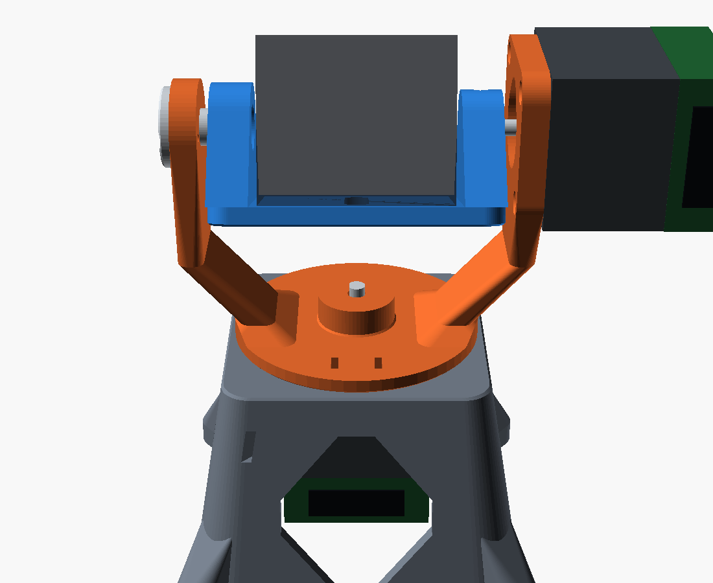
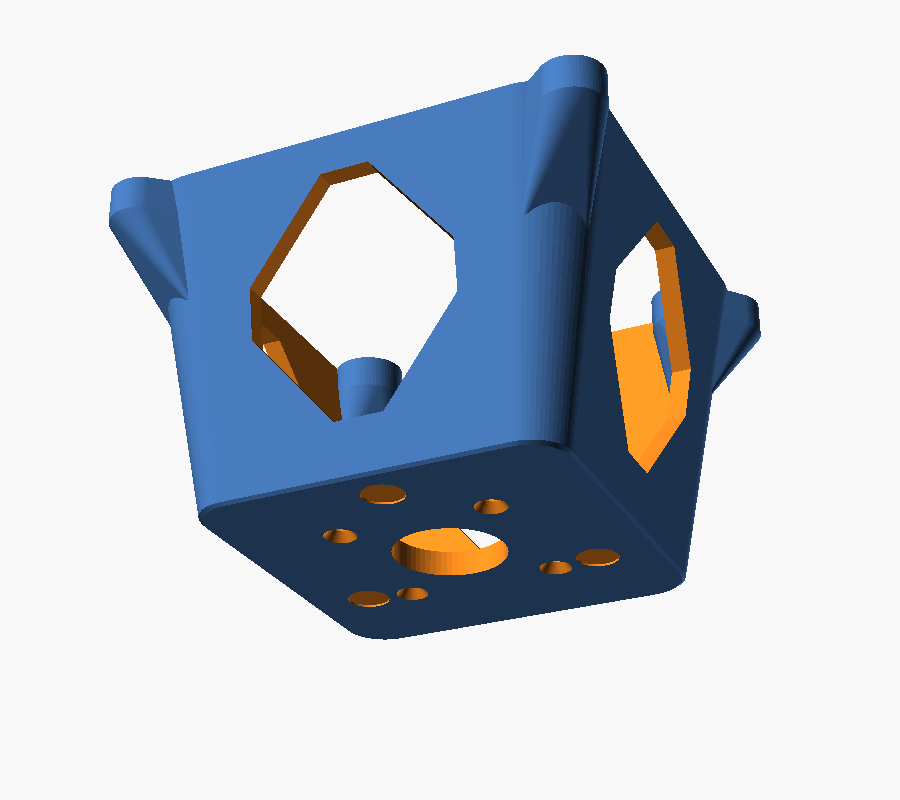
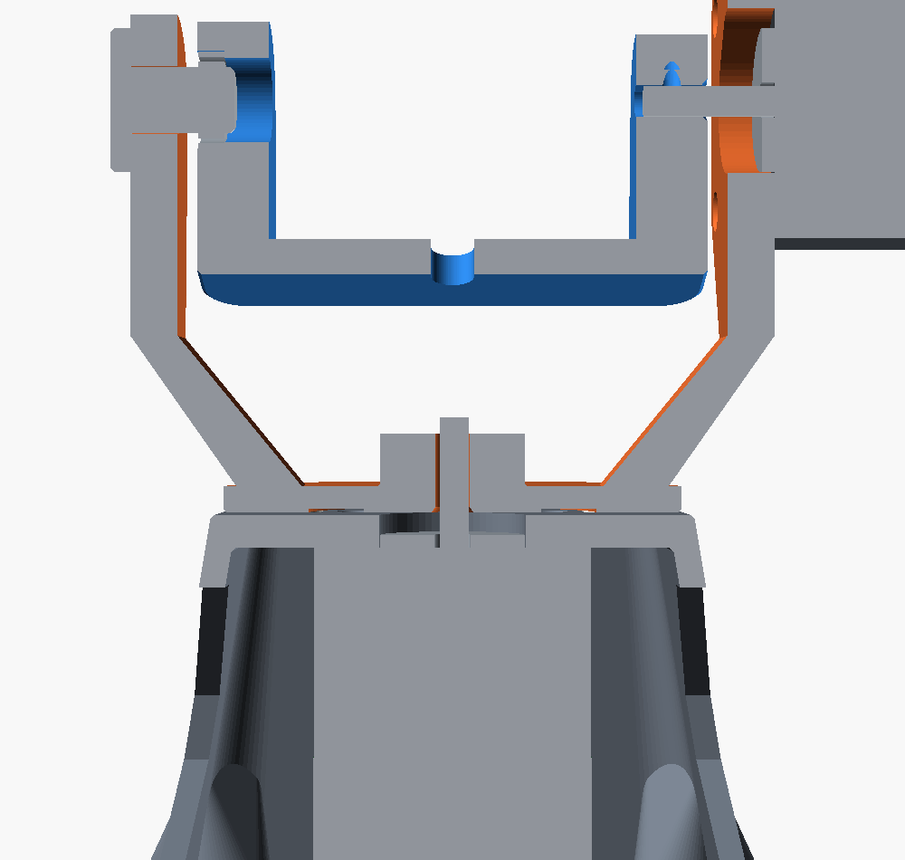
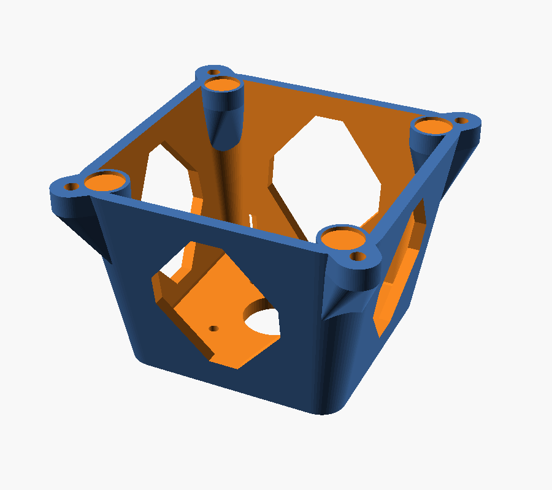

# Two-axis camera gimbal

A pan/tilt camera gimbal built from two NEMA17 32 mm motors, each carrying an
MKS SERVO42D_CAN driver on its back face. Four printed parts, no supports, and it
stands on a desk.

| Part | Module | Joins | Mass |
| --- | --- | --- | --- |
| **A** | `pan_yoke()` | pan shaft → a fork carrying the tilt axis | 58 g |
| **B** | `camera_cradle()` | tilt axis → camera | 42 g |
| **C** | `pedestal()` | pan motor → desk | 114 g |
| **D** | `pivot_pin()` | fork arm → the tilt axis' far bearing | 3 g |

Bought parts that matter: one **6700 ball bearing** (10 × 15 × 4) at the far end
of the tilt axis, **three Ø8 PTFE glide pads** at the pan axis, and **two M3
heat-set inserts** for the shaft joints. Each of those replaces something the
plastic was previously being asked to do on its own.



## How the load gets to the desk

FDM parts are roughly half as strong across layers as along them, so the design's
job is to keep the steady loads out of layer-normal tension:

| Load | Where it goes |
| --- | --- |
| camera weight | down each fork arm as **compression** — the arms print vertically |
| overturning moment | into the yoke's **70 mm pad**, running on three PTFE pads set into the pedestal's plate |
| tilt bending | the motor's own bearings at one end, a **6700 ball bearing** at the other |
| torque, both axes | all either shaft joint has to transmit |
| all of it | a **tapered shroud** in shell shear, onto a 96 mm footprint you can screw down |

Four consequences worth stating, because each replaced something that looked fine
and wasn't:

**The tilt axis crosses the pan axis.** The camera turns about a line through its
own body, so it stays inside the fork and balances about the axis instead of
hanging off a bracket. A cantilevered arm puts the payload's *static* weight into
the root as tension across the layers, which is the one direction the material is
weak in.

**The tilt axis is supported at both ends** — the motor's shaft on one side, a
6700 bearing on the other. The bearing is not there for load: it carries about
2 N against a 200 N static rating. It is there because the thing it replaced was a
screw shank turning in a printed journal, and a plain plastic bearing under a
side load wears into an oval. Every micron of that wear is backlash in an axis
whose job is to point at something.

**The pan bearing is a face, not a shaft — and now it is actually touching.** The
yoke's pad bears on a 13 mm-wide ring at its rim, running on three Ø8 self-adhesive
PTFE discs recessed into the pedestal's plate. The previous version left 0.4 mm of
air in that joint and still claimed the pad carried the overturning moment: it
would have, after deflecting 0.4 mm, by which point the 5 mm shaft had already
taken the load the pad was there to keep off it. An interface that only engages
once something has bent is not an interface. Three pads rather than a ring because
three points cannot rock; PTFE rather than plastic on plastic because the friction
torque is then ~11 N·mm against the motor's ~400 N·mm of holding torque instead of
four times that.

**Neither shaft is clamped, and neither is tapped.** Torque goes through the
D-flat, which is a positive drive; the screw only takes up bore clearance and stops
the part sliding. It threads into a brass heat-set insert, because a screw tapped
straight into PLA is a one-shot thread and taking the cradle off to re-balance is
routine here, not an accident. See [Holding things to a shaft](#holding-things-to-a-shaft).



*The pedestal's plate, from the side the yoke runs on: three glide-pad recesses
threaded between the four countersunk motor screws. Getting those two sets of
holes to miss each other is the reason the pads are in this part and not the
other one.*



## What the driver dictates

The SERVO42D covers the whole back face and puts hardware on all four edges
(manual page 2):

| Edge | What is there |
| --- | --- |
| top | 4-way screw terminal, motor phases |
| left | 5-way terminal — EVCC, EGND, IN_1, CAN_H, CAN_L |
| right | 6-way terminal — V+, GND, COM, EN, STP, DIR |
| **bottom** | **OLED display and the Next / Enter / Menu buttons** |

The bottom edge is the binding constraint. On firmware below V1.0.6 the work
mode, `Ma` (working current) and `HoldMa` cannot be read back over CAN at all —
`Axis.initialize()` reports `work mode unreadable` — so the OLED and its three
buttons are the *only* way to see or change them. A bracket that covers them
makes the motor unconfigurable.

So the pan motor hangs inside a shroud that is open on all four sides, with
14 mm of air below it for fingers and wire bends. This is also why the hold-down
ears are on the corners: an ear on a flat face needs 20 mm of wall above the
opening to blend into, and that 20 mm is exactly where the OLED sits.



## Printing

**PETG for preference**, PLA if the motors will not be held under load for long.
0.2 mm layers, 4 perimeters, ≥40% infill. **No supports**, in the orientations
below — which are also how the parts are modelled, so what
`check_printability.py` reads off the STL is what the slicer sees.

| Part | Orientation | Height | Bed footprint | Widest bridge |
| --- | --- | --- | --- | --- |
| A pan yoke | pad on the bed, arms up | 84 mm | 2707 mm² | 9.0 mm |
| B camera cradle | platform on the bed, cheeks up | 37 mm | 3090 mm² | 10.0 mm |
| C pedestal | top plate on the bed, desk end last | 67 mm | 4557 mm² | 10.0 mm |
| D pivot pin | flange on the bed, journal up | 19 mm | 281 mm² | none |

The material choice is a thermal one, not a strength one. In the `OPEN` and
`CLOSE` work modes these drivers hold **full `Ma` regardless of load**, and a
NEMA17 held at 1.5 A settles at 60–70 °C — which is PLA's glass transition. Both
motors bolt straight to a printed part, so a PLA build that holds position all
day will creep at the mounting faces. PETG moves that limit ~20 °C away. If you
are printing PLA anyway, drop `HoldMa` on both axes and balance the tilt properly.

The shallowest down-facing wall on any part is **48°** from horizontal. Nothing
drafts at exactly 45° on purpose: that is the threshold every slicer compares
against, so surfaces here draft at **40°** and land unambiguously on the right
side of it.

Other things the slicer was allowed to dictate:

- Load-bearing walls are whole multiples of 0.4 mm, so they fill with perimeters
  rather than leaving a sliver of gap-fill down the middle.
- Every bed edge is chamfered 0.6 mm. Elephant's foot squashes the first layer
  outward by a couple of tenths, and on two of these parts the first layer *is*
  the mating face.
- The apertures and the arms taper at both ends instead of stopping square —
  which turns a 42 mm span into a 10 mm one, and hands the wall's shear off into
  the corners diagonally rather than ending in two stress-raising notches.
- The cradle's bore is printed with the **D-flat upward**, so the bore's ceiling
  is a flat 4.5 mm bridge rather than a drooping arc. It is also the face that
  takes the torque.
- Shaft bores have a lead-in chamfer, so a squashed first layer cannot stop the
  part going on.
- The insert hole in the yoke's hub is 4.2 mm and the one in the cradle's is
  4.0 mm, for the same M3 insert. The first prints on its side and comes out
  undersize; the second prints upright and does not.

## Hardware

| Qty | Item | For |
| --- | --- | --- |
| 4 | M3×8 countersunk | pan motor to the pedestal's plate |
| 4 | M3×10 | tilt motor to the fork arm |
| 2 | M3 heat-set insert (Ø4.6 × 5.7) | the two shaft joints |
| 1 | M3×10 set screw | pan joint, onto the D-flat |
| 1 | M3×8 set screw | tilt joint, onto the D-flat |
| 2 | M3×8 countersunk | the pivot pin's keepers, into the fork arm |
| 1 | **6700 ball bearing, 10 × 15 × 4** | the tilt axis' far end |
| 3 | **Ø8 self-adhesive PTFE glide pad, ~0.8 mm** | the pan axis |
| 1 | ¼"-20 | the camera |
| 4 | 12 mm self-adhesive rubber feet | the pedestal's ears |
| 4 | M4 wood screws | *optional* — screwing it to the bench |

**Do not reach for longer motor screws.** A NEMA17's front face is tapped about
4.5 mm deep, so through a 5 mm plate an M3×8 leaves 3 mm of engagement and an
M3×10 through the 7.2 mm arm leaves 2.8 mm. That sounds thin and is not: 3 mm of
M3 in steel is good for over 3 kN, against the ~5 N it holds. An M3×12 in the arm
would bottom out in the tapping and never clamp at all.

### Holding things to a shaft

Both joints onto a 5 mm D-shaft are the same three things doing three different
jobs:

| | Job |
| --- | --- |
| the D-bore | takes the **torque** — the flat cannot slip past the flat, clamped or not |
| a brass insert | takes the **thread**, so it survives being taken apart |
| a set screw on the flat | takes up the bore clearance and stops the part **sliding** |

The hub dimensions follow from that rather than the other way round: a set screw
has to cross the insert and then a clearance hole to reach the flat, so the pan
hub's flat sits 12.0 mm off the axis (9.93 mm of travel → a stock M3×10 finishes
flush) and its diameter is 22 mm so that flat is a 1 mm boss rather than a cut.
The cradle's hub gives 7.92 mm, which is an M3×8.

**Why not a split clamp.** A split clamp has to close, and both of these hubs
stand on something stiff — the yoke's on a 70 mm pad, the cradle's on a 78 mm
platform. Slitting a hub that is bonded along its whole base to a plate like that
buys the slit's stress concentration and none of its compliance.

### Why the pivot is a separate part

The bearing has to end up pressed into the cradle's cheek and running on something
attached to the fork, and the cradle has only 3 mm of side clearance to get in
there — less than the bearing is wide. A journal moulded onto either part could
therefore only be assembled by springing the fork open, and the fork cannot be
made wider because the tilt shaft is 20 mm long and already only reaches 9.8 mm
into its bore. A pin fitted from *outside* the arm has none of that problem, and
it comes back out again — which matters, because taking the cradle off is how you
re-balance after a lens change.

Its journal runs 1.5 mm past the bearing into a relief behind the pocket, and that
overrun is the joint's axial tolerance: the cradle can sit 1.5 mm further out than
nominal with the bearing still fully supported.

## Assembly order

It matters, because the tilt shaft and the pivot pin come in from opposite sides:

1. Heat-set the two M3 inserts — one in the flat on the yoke's hub, one in the top
   of the cradle's shaft hub.
2. Press the 6700 into the pocket in the cradle's **−X** cheek, from outside,
   until it bottoms on the shoulder. It should need thumb pressure and something
   flat to push against. If it will not start, chamfer the mouth of the pocket
   with a knife — do not open the pocket out, the interference *is* what holds
   the bearing.
3. Bolt the pan motor up into the pedestal's plate (countersunk screws, from
   above). Stick the three PTFE pads into their recesses in that same face, and
   the rubber feet onto the ears.
4. Drop the yoke onto the pan shaft **until its ring sits down on the PTFE pads**,
   and only then tighten the set screw onto the flat. Do it the other way round —
   screw nipped up with the yoke still standing off the pads — and the shaft ends
   up carrying the weight the pads are there to take, which is the whole thing
   this joint was redesigned to stop.
5. Bolt the tilt motor to the outside of the **+X** arm, shaft pointing inward.
6. Slide the cradle onto the tilt shaft. With it roughly in place, push the pivot
   pin in through the outside of the **−X** arm so its journal enters the bearing,
   seat its flange on the arm and fit the two keeper screws.
7. Tighten the cradle's set screw onto the tilt shaft's flat.
8. Bolt the camera on and slide it along the slot until the tilt axis balances.
9. Zip-tie the tilt motor's harness to the yoke's pad and the pedestal's corner
   slots, leaving a service loop for ±170° of pan.

The pin's keeper screws are not in the load path — the journal in its hole is.
They stop the pin walking out.

Which way the D-flat happens to face is set by which of the four bolt
orientations you use and where the rotor is — so **set the tilt zero in firmware**
once it is together, rather than trying to make the flat land somewhere.

## Verifying a change

`gimbal_parts.scad` is parametric, and a plausible-looking edit can quietly move
the camera into the yoke.

```
python check_clearances.py            # exits non-zero on a clash
python check_printability.py          # exits non-zero if anything needs support
python check_physics.py               # exits non-zero if it will not balance or stand
python check_clearances.py --fast     # skip the exact pass: instant instead of ~2 min
```

Each answers a different question: *can it be made*, *can it touch itself*, and
*what happens once something heavy is bolted to it*.

The exact pass is 22 CGAL booleans at about 19 s each. They run six at a time,
which is the difference between two minutes and seven — and seven is long enough
that the check stops being run, which is the only way it can be worth nothing.
Each worker writes its own scratch STL; sharing one filename would have every
worker read someone else's answer, or zero.

`check_clearances.py` reports three kinds of number, and mixing them up is how
this design shipped a 4.4 mm interpenetration with a check that said +2.5 mm:

**swept** — varies with tilt. Includes the payload at both ends of its balance
slot, because the payload is the largest thing that moves.

**static** — set once when you assemble it. Each carries its own minimum, because
they are not the same requirement: a swept clearance absorbs warp, a slipped
joint and a camera bigger than its screw, while the gap between a rotating cradle
and a fixed arm absorbs warp and nothing else. "Spare shaft" is not air at all —
it is tolerance against a motor whose shaft is shorter than the 20 mm assumed
here, the one dimension on these motors that genuinely varies by supplier.

Three of these belong to the glide pads, and they are there because that placement
is a constraint shared between two parts that never appear in the same module: the
recesses are cut in the pedestal's plate, the surface they bear on is a ring on the
yoke, and the things they must not overlap are the pedestal's own countersunk motor
screws. Nothing in the `.scad` relates those three, so a pad could end up half off
its bearing surface and no render would look wrong. (That is also why the pads are
in the plate and not in the yoke: a recess in the yoke's ring at this radius would
sweep across the screw heads once per revolution, and no radius clears them and
still lands inside the ring.)

**exact** — OpenSCAD's own `intersection()`, exported and measured. This is the
authoritative one. It does not approximate anything, and it is the only check that
would have caught the fork being narrower than the cradle:

```
openscad -D 'part="interference"' -D tilt=-45 -D 'against="yoke"' \
         --export-format binstl -o /tmp/x.stl gimbal_parts.scad
```

An empty intersection makes OpenSCAD decline to write a file at all, which is
itself the answer. Where it does write one, the test is on **volume**, not on
whether the mesh is empty: coincident faces are everywhere in an assembly — a
motor's face bolts flat against a plate — and CGAL returns those contacts as a
zero-thickness solid with a few dozen facets in it.

Pan is swept for the pedestal alone. Everything else on the fixed side is bolted
to the yoke and turns *with* the cradle, so their relative geometry is
pan-invariant; the pedestal's plate is a rounded square, so its corners pass under
the camera's nose at 45° and not at 0°.

There is also a `part="fit"` case, which is the one pair of parts that are **both
fixed and still have to fit each other**: the pivot pin and the arm it passes
through. `interference` cannot see that pair — it compares what moves against what
does not, and they are on the same side of that line — so until this existed the
only thing holding the pin in the right place was the same arithmetic written out
twice, once to cut the hole and once to position the part. Putting the flange 3 mm
the wrong side of the arm scores 780 mm³; it should be zero.

Current state:

| | Clearance | |
| --- | --- | --- |
| pedestal plate | 29.8 mm | swept, worst at tilt +54° |
| yoke pad | 25.4 mm | swept |
| yoke hub | 23.0 mm | swept |
| fork arm | 3.0 mm | swept, worst at tilt −45° |
| camera to cheek | 2.0 mm | static, each side |
| tilt bore vs shaft tip | 1.2 mm | static — bore 11 mm, shaft reaches 9.8 mm in |
| bearing seat wall | 4.6 mm | static, round a 14.9 mm pocket |
| pin overrun past the race | 1.5 mm | static — the tilt joint's axial slack |
| glide pad to a motor screw | 1.9 mm | static, in the plate |
| exact overlap | 0 mm³ | 5 tilts at pan 0, plus tilt ±45/90 at pan 45 |
| pin in the arm's hole | 0 mm³ | `part="fit"` |

### The printability checker had a blind spot, and the glide pads found it

Worth knowing before you trust its output. It used to classify any down-facing
facet within 0.5 mm of the lowest point as "the part sitting on the bed", which is
what keeps the 0.6 mm bed chamfer from being reported as a 45° overhang on every
part. Add a recess 0.4 mm deep and its ceiling gets the same treatment — so the
three glide-pad pockets, when they were still in the yoke, silently removed three
10 mm bridges from the measurement, and the part passed.

No single height separates 0.4 mm from 0.6 mm, so the two questions now get the
two thresholds they actually need: bridges are measured against anything that does
not *lie on* the bed, and the wall-angle figure ignores down-faces that begin
within a chamfer's height of it. Which also fixed a smaller lie — the "shallowest
wall" was reported as 45° on two parts, and it was a 0.14 mm² triangle where a
lead-in cone meets a bore. The real answer is 48°, and the figure now walks past
slivers until it has 1 mm² of surface and says how much it skipped.

### Why the swept margins are so large

They are not chosen. The fork's height is set by its arms' draft angle, not by
the payload: the arms have to splay 19 mm outboard to clear the cradle, and they
cannot do that faster than 40° per millimetre of rise without needing support.
That fixes the tilt axis at 63 mm above the yoke, which leaves far more room
underneath than the sweep needs — so a payload larger than the 52 × 44 × 34 mm
envelope assumed here will still clear everything below it. What it will *not*
clear is the cheeks: the camera has to fit **between** them, and that gap is 56 mm.

The three couplings worth knowing before you edit anything:

- **The arms must reach full width below the cradle's lowest sweep.** They splay
  to `arm_gap / 2` by `arm_mid_z` and stand vertical above it. Fold that into one
  hull and the arms only reach full width at the motor pad's bottom edge — which
  rises *with* the tilt axis, so raising the axis never opens the fork and the
  cradle interpenetrates it at every angle. That was the bug.
- **`axis_z` and `tilt_axis_h` move together.** Raising the tilt axis inside the
  cradle to balance the payload lowers the platform relative to the fork, and at
  tilt −45° the platform's rear corner drops to 34 mm below the axis. Moving
  `axis_z` from 22 to 25 put that corner 0.2 mm *below* `arm_mid_z`, into the part
  of the fork that is still leaning inward, which is why `tilt_axis_h` went from
  60 to 63 in the same change. There is 2.8 mm of margin now.
- **The cradle's bore must be deeper than the shaft reaches.** Whatever the bore
  does not contain protrudes past it, into the space the camera occupies.

## Viewer

`gimbal_viewer.html` is a self-contained page with pan/tilt sliders, pose presets
and an orbit view. It is generated, not hand-maintained, so its geometry cannot
drift from the printed parts:

```
python make_visualizer.py
```

It reads every dimension out of `gimbal_parts.scad` — including the assembly
frame the `.scad` derives — and runs the real clearance sweep to fill in the
figures it quotes. Renders of each part are in `render/`.

## Driving it

```
# against the simulator
mks-servo-simulator --num-motors 2 --start-can-id 2 --latency-ms 0
python examples/camera_gimbal_tracker.py --two-axis --can-ids "pan=2,tilt=3"

# against the hardware
python examples/camera_gimbal_tracker.py --hardware --channel can0 \
    --two-axis --can-ids "pan=2,tilt=3"
```

`--two-axis` drops the roll stage; roll changes how the frame is oriented about
the optical axis, not where the camera points, so a two-motor build is a
perfectly good tracking gimbal.

Soft limits assumed by both the example and the clearance check: pan ±170°,
tilt −45°…+90°. Pan is limited rather than continuous because the camera cabling
has to come back down past the yoke.

## Balance, and why it matters more here than usual

A stepper holding a static gravity torque burns current continuously — and in the
`OPEN` and `CLOSE` work modes these drivers hold **full `Ma` regardless of load**,
so an unbalanced axis is not merely wasted torque, it is a motor that runs hot
doing nothing. It is also what sets the material choice above.

Balance has two directions and they are handled differently. **Fore and aft** is
yours to trim: the ¼"-20 runs in a 20 mm slot, so slide the camera until the axis
balances and re-check after any lens change. A strip of thin rubber under the
camera stops it rotating about its screw.

**Vertically** it is designed in, and that is what `axis_z` is for. The tilt axis
sits 20 mm above the platform's top face, which is inside the payload's body rather
than under it. Measured off the exported STL, the cradle's own 42 g sit 9.9 mm up,
so the combined centre of mass lands:

| Payload | Combined CG, relative to the axis | Standing torque |
| --- | --- | --- |
| none | 15.1 mm **below** | 6 N·mm |
| 150 g | 1.7 mm below | 3 N·mm |
| 300 g | 0.1 mm below | 0.3 N·mm |
| 600 g | 0.9 mm above | 6 N·mm |

Against roughly 400 N·mm of holding torque, all of that is noise — which is the
point. The axis is neutral at about 300 g and *bottom*-heavy below that, which is
the safe direction: a bare or lightly loaded cradle hangs level rather than
flopping over when the power goes off.

It also removes work from the other axis. A payload balanced on the tilt axis does
not move horizontally when it tilts, so the pan axis sees almost no overturning
moment at any angle — the yoke's pad is left carrying weight and vibration rather
than a lever arm.

## Standing on a desk

| Payload | Total mass | CG height | Tips at |
| --- | --- | --- | --- |
| none | 0.21 kg | 67 mm | 39° |
| 300 g | 0.51 kg | 105 mm | 27° |
| 600 g | 0.81 kg | 115 mm | 25° |

"Tips at" is the desk tilt that would put the centre of mass outside the circle
through the four rubber feet — a stand-in for how hard you can knock it. Feet plus
0.5 kg is enough for tracking a room, and the four M4 ears are there for when it
is not: a fast pan on a 115 mm lever arm is more than sticky feet will hold.

`check_physics.py` prints that table, and the balance one above it, from the
exported STLs. Both are properties of the whole assembly *including its payload*,
so neither can be read off a dimension in the `.scad` — which is exactly how a
number like this goes stale in a README while the design moves underneath it.

Leave it room: the tilt motor's driver reaches 97 mm from the pan axis, so the
machine sweeps a **194 mm circle** and stands 154 mm tall with a 44 mm camera on it.

## The one number to check against your motors

Everything along both shafts is budgeted against an assumed **20 mm shaft length**
from the front face, which is the conservative end of what 32 mm-body NEMA17s
ship with. **Measure yours before printing.** With a shaft 2 mm shorter than
assumed, the joints still engage 7.8 mm (tilt) and 10.0 mm (pan); the checker
reports both. Also confirm the D-flat: the design assumes a 5 mm shaft cut to
4.5 mm across the flat (`shaft_d`, `shaft_flat`), and a different flat depth just
needs `shaft_flat` changed — every bore follows it.

## Building it

```
openscad -D 'part="A"' --export-format binstl -o stl/pan_yoke.stl      gimbal_parts.scad
openscad -D 'part="B"' --export-format binstl -o stl/camera_cradle.stl gimbal_parts.scad
openscad -D 'part="C"' --export-format binstl -o stl/pedestal.stl      gimbal_parts.scad
openscad -D 'part="D"' --export-format binstl -o stl/pivot_pin.stl     gimbal_parts.scad
```

Pre-built STLs are in `stl/`. To preview the whole thing, or to cut it open on the
plane both axes lie in:

```
openscad -D 'part="assembly"' -D pan=25 -D tilt=-20 gimbal_parts.scad
openscad -D 'part="section"'  -D tilt=-20           gimbal_parts.scad
```

The cutaway is worth a look before you print: the pan hub on its shaft, the glide
pads in their recesses and the bearing on its pin are all fits you cannot see from
outside, and a fit nobody looks at is a fit nobody notices is wrong.
